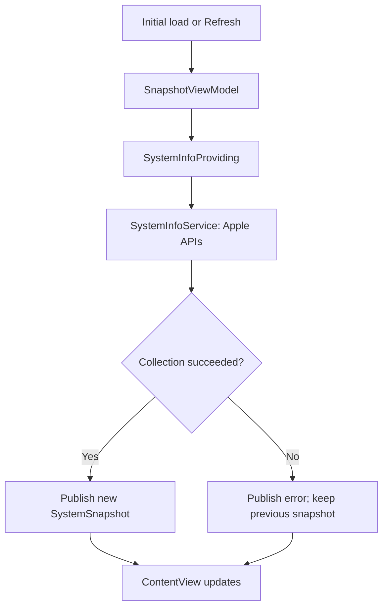
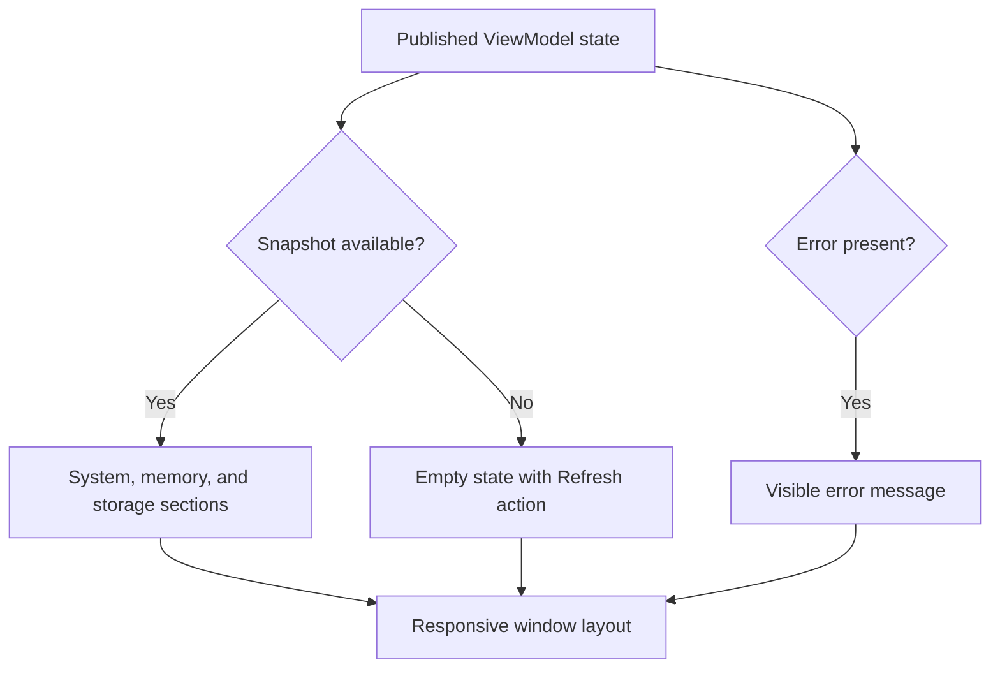
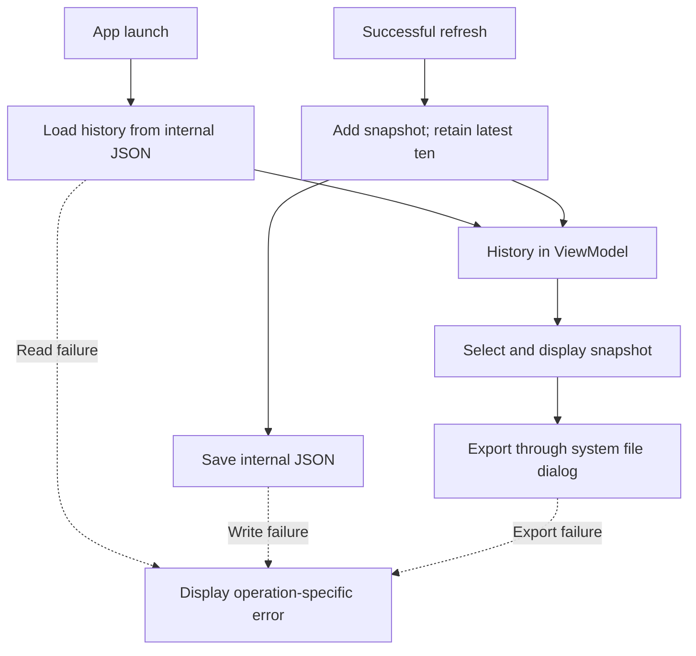
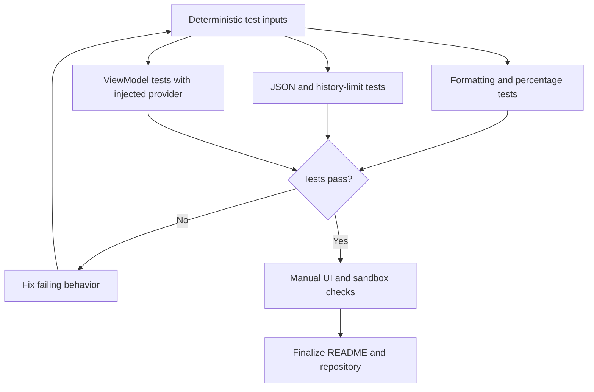

# Mac System Snapshot

A native macOS utility built with Swift and SwiftUI that captures and displays a point-in-time overview of the current Mac. System information is collected through standard Apple APIs with App Sandbox enabled.

The project is being developed in four milestones. **Milestones 1 and 2 are implemented, with local execution confirmed on an Apple Silicon Mac.** Milestone 3 (history and export) is in progress; automated tests remain planned. The features below describe the completed Milestone 2 version.

## Current features

- Device name and macOS version.
- Processor architecture and active logical processor count.
- Installed physical memory.
- Total and available space on the volume containing the app's home directory.
- Timestamp of the last successful refresh.
- Manual refresh using the Refresh button or Command-R while the app is focused.
- Refined SwiftUI interface with System, Memory, and Storage sections.
- Adaptive card layout, selectable values, scrolling, and a minimum window size.
- Available disk percentage and a visual availability indicator.
- Native refresh toolbar, empty state, and an error banner with Retry.
- Visible collection errors; an unsuccessful refresh preserves the previous successful snapshot.

Snapshots are collected on initial display and on demand. The app does not continuously monitor CPU load or memory usage. History and export are not available in the current milestone.

## Screenshots

Each milestone below has a reserved screenshot path. Screenshots are added as milestones are documented. Image references are commented out until their files are committed, so unfinished milestones do not display broken images.

Store screenshots as PNG files in `docs/screenshots/`, using `image-1.png` through `image-4.png`. Once a file is present, remove the HTML comment markers around its Markdown image reference below.

## Technologies

- Swift and SwiftUI
- Foundation for system information, dates, and formatting
- Darwin for processor architecture detection through `sysctlbyname`
- Combine for `ObservableObject` and `@Published`
- App Sandbox
- XCTest planned for Milestone 4

No third-party packages, shell subprocesses, networking, or database are used.

## Architecture

The application uses a small MVVM structure. `SystemSnapshot` is an immutable value model. `SystemInfoService` collects data, `SnapshotViewModel` coordinates refreshes and exposes state, and `ContentView` renders that state. The service is injected through `SystemInfoProviding` so that ViewModel behavior can later be tested with controlled inputs.

`@StateObject` preserves the ViewModel at the app level. The view observes it through `@ObservedObject`; assigning a new snapshot to its `@Published` property triggers UI updates. The ViewModel is isolated to `@MainActor`.

## Development roadmap

| Milestone | Scope | Status |
| --- | --- | --- |
| 1 | Model, system service, ViewModel, basic interface, refresh | Implemented; local launch confirmed |
| 2 | Refined interface, logical sections, storage visualization, error presentation | Implemented; local execution confirmed |
| 3 | JSON persistence, last ten snapshots, history selection, JSON export | In progress |
| 4 | XCTest coverage, focused refactoring, final documentation and repository review | Planned |

### Milestone 1 — System collection and basic UI · Implemented

Implemented flow: an initial load or manual refresh requests a new snapshot. Collection failures are displayed without discarding the previous result.

### Milestone 2 — Interface refinement · Implemented

Implemented: System, Memory, and Storage sections; adaptive cards; consistent spacing and typography; disk availability with a calculated percentage; a native refresh toolbar; and dedicated empty and error states. `SnapshotDetailView` displays a snapshot independently of collection logic. System colors support light and dark appearance. No loading spinner is used for the current synchronous collection operation.

### Milestone 3 — History and JSON export · In progress

Implementation underway: load and save history in the sandbox container's Application Support directory, retain the latest ten snapshots, and allow selection of previous records. Export the selected snapshot through a standard system file dialog. Handle reading, writing, and export errors separately; a failed save must not be reported as successful persistence.

### Milestone 4 — Tests and repository preparation · Planned

Planned: add XCTest cases for memory and disk formatting, free-space calculations, JSON round trips, history limits, and ViewModel success and failure behavior using an injected test provider. Review error handling, naming, duplicated logic, repository contents, and documentation.

## Requirements

- macOS 14.0 or later.
- Xcode with the macOS SDK and support for the project's deployment target.
- No external dependencies or paid services.

Development and the initial local launch were performed on a MacBook Air M3. Intel and Rosetta execution have not been verified.

## Running the application

1. Clone or download this repository.
2. Open `MacSystemSnapshot.xcodeproj` in Xcode.
3. Select the `MacSystemSnapshot` scheme and the **My Mac** destination.
4. Keep **App Sandbox** enabled under the app target's **Signing & Capabilities** settings.
5. If Xcode requests signing configuration, select your development team.
6. Choose **Product > Run** or press **Command-R** in Xcode.

The main window displays a snapshot after its initial load. Use **Refresh** to collect another one. At this milestone, quitting the app discards the in-memory snapshot.

## Testing

An XCTest target has not been added yet. Automated coverage is planned for Milestone 4; no automated test results are claimed for the current version.

Current manual checks:

- Launch with App Sandbox enabled.
- Compare the device name, macOS version, and installed memory with the Mac's settings.
- Confirm that disk values are nonnegative and available space does not exceed total space.
- Refresh after a few seconds and check that the timestamp changes.
- Resize the window and check that cards switch between one and two columns.
- Check light and dark appearance.
- Compare the available percentage with available bytes divided by total bytes.

Once the XCTest target is implemented, tests will be run using **Product > Test** or **Command-U** in Xcode.

## Project structure

Source paths below are relative to the `MacSystemSnapshot` application directory.

| Path | Responsibility |
| --- | --- |
| `MacSystemSnapshotApp.swift` | App entry point, dependency composition, single main window |
| `Models/SystemSnapshot.swift` | Immutable, Codable snapshot model |
| `Services/SystemInfoProviding.swift` | System-information provider contract |
| `Services/SystemInfoService.swift` | Foundation and Darwin API access; collection errors |
| `ViewModels/SnapshotViewModel.swift` | Observable snapshot state and refresh coordination |
| `Formatting/SnapshotFormatting.swift` | Memory, disk, percentage, and timestamp formatting |
| `Views/ContentView.swift` | Page composition, toolbar, empty and error states |
| `Views/SnapshotDetailView.swift` | Device header, adaptive system and memory cards, storage indicator |
| `PrivacyInfo.xcprivacy` | Declared reason for accessing disk-space APIs |
| `Assets.xcassets` | App visual resources |

The repository root contains `MacSystemSnapshot.xcodeproj`, `.gitignore`, and this README. Persistence, export, and test files will be added in later milestones.

## Implementation notes

- **Snapshot semantics:** each successful capture creates a new UUID and timestamp. Values are read sequentially, not as an atomic operating-system snapshot.
- **Raw data and presentation:** byte counts remain numeric in the model. Memory is displayed in GiB and disk space in decimal GB; display formatting follows the current locale.
- **Storage scope:** disk values describe the filesystem containing the app's home directory. Available space uses `systemFreeSize` and may differ from Finder's estimate of available space including reclaimable storage.
- **Architecture:** the service queries `hw.optional.arm64` through Darwin rather than relying only on the compiled process architecture.
- **Error handling:** collection errors are propagated to the ViewModel. An unavailable device name uses `Unknown Mac`; unreadable or inconsistent disk information produces an error.
- **Execution:** collection currently runs synchronously on the main actor. No directory scanning or background polling is performed.
- **Derived values:** `availableDiskFraction` computes a value from 0 to 1, returning `nil` for invalid disk inputs. It is a computed property and is not included in synthesized Codable output.
- **Serialization:** the model already conforms to `Codable`; file persistence and export remain planned work.
