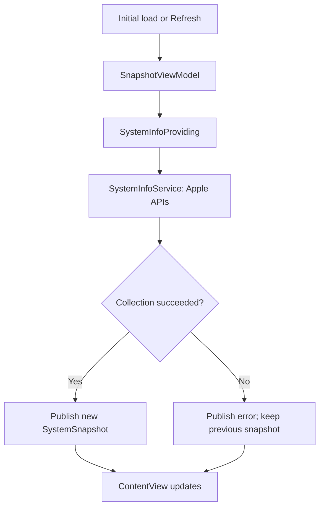
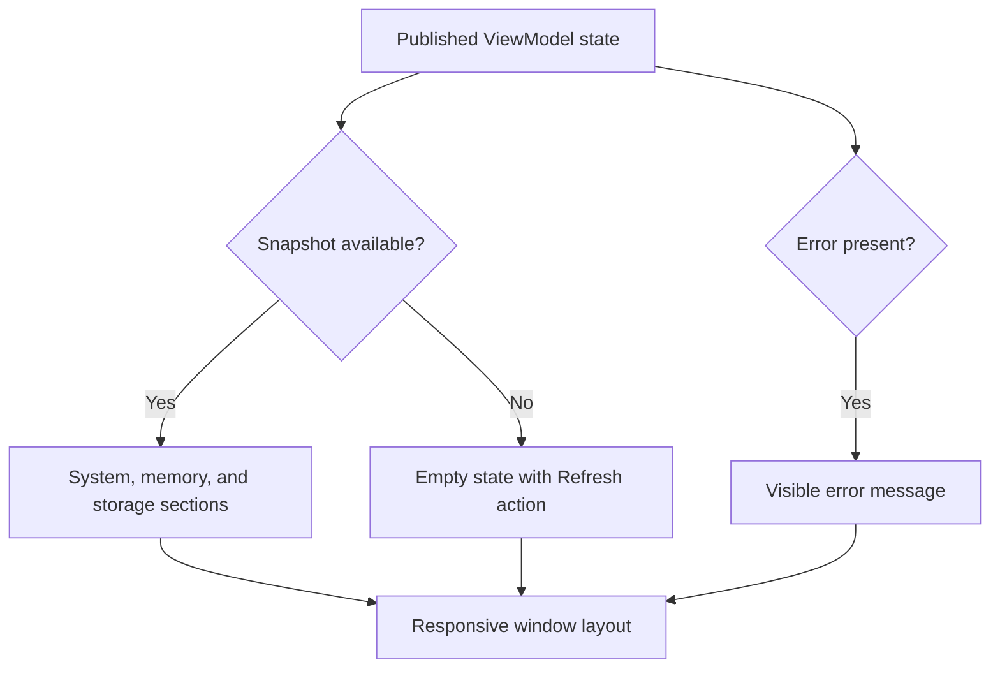
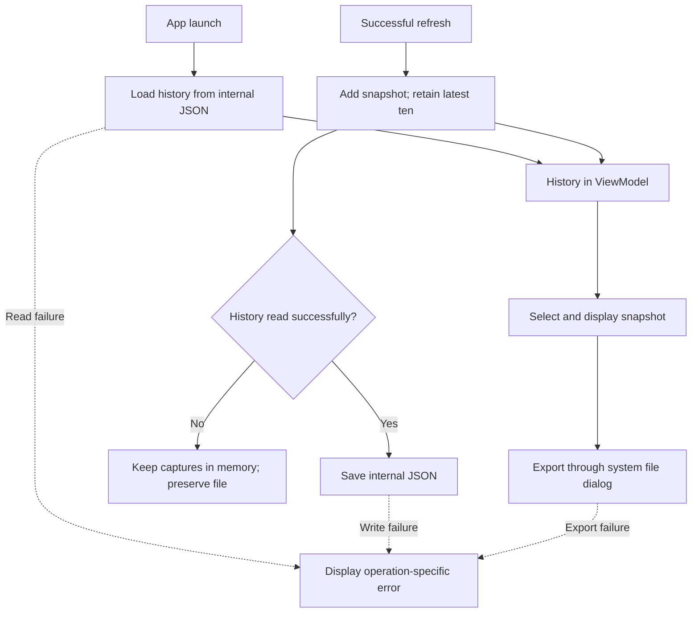
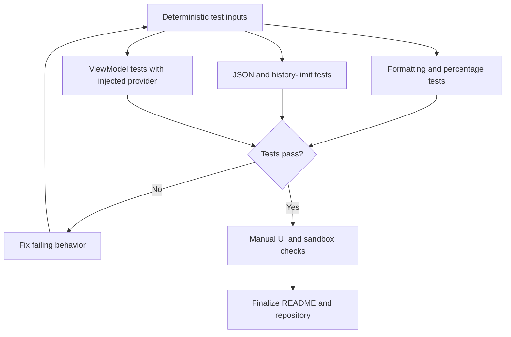

# Mac System Snapshot

A native macOS utility built with Swift and SwiftUI that captures and displays a point-in-time overview of the current Mac. System information is collected through standard Apple APIs with App Sandbox enabled.

The project is being developed in four milestones. **Milestones 1–3 are implemented, with local execution confirmed on an Apple Silicon Mac.** Milestone 4 (automated tests and final review) is in progress. This README describes the completed Milestone 3 version; automated test results are not yet available.

## Current features

- Device name and macOS version.
- Processor architecture and active logical processor count.
- Installed physical memory.
- Total and available space on the volume containing the app's home directory.
- Capture timestamp for each snapshot.
- Manual refresh using the Refresh button or Command-R while the app is focused.
- Refined SwiftUI interface with System, Memory, and Storage sections.
- Adaptive card layout, selectable values, scrolling, and a minimum window size.
- Available disk percentage and a visual availability indicator.
- Native refresh toolbar, empty state, and an error banner with Retry.
- Local JSON persistence and restoration of history on launch.
- History sidebar with selection of the latest ten captures.
- Export of the selected snapshot as JSON through a native save dialog (Command-E).
- Separate collection, persistence, and export errors with retry actions.
- Failed refreshes preserve existing snapshots; failed saves retain changes in memory.
- Unreadable history is not automatically overwritten.

Snapshots are collected on initial display and on demand. The app does not continuously monitor CPU load or memory usage. History is saved after successful captures. Export creates a separate copy of the selected snapshot.

## Screenshots

Screenshots for the first two milestones are embedded below. Add the history screenshot as `docs/screenshots/image-3.png` and the test-results screenshot as `docs/screenshots/image-4.png`, then uncomment the corresponding Markdown image reference.

## Technologies

- Swift and SwiftUI
- Foundation for system information, dates, and formatting
- Darwin for processor architecture detection through `sysctlbyname`
- Combine for `ObservableObject` and `@Published`
- App Sandbox
- AppKit and Uniform Type Identifiers for the native JSON export dialog
- XCTest coverage in progress for Milestone 4

No third-party packages, shell subprocesses, networking, or database are used.

## Architecture

The application uses a small MVVM structure. `SystemSnapshot` is an immutable value model. `SystemInfoService` collects data, `SnapshotViewModel` coordinates captures, history, selection, and errors. `ContentView` renders the sidebar and page state; `SnapshotDetailView` renders the selected capture. The service is injected through `SystemInfoProviding` so that ViewModel behavior can later be tested with controlled inputs.

`JSONSnapshotStore` implements `SnapshotStoring` and persists history under Application Support. `SnapshotJSON` centralizes serialization settings, and `SnapshotExporter` handles the native save dialog and export. `SnapshotHistory` limits and deduplicates records.

`@StateObject` preserves the ViewModel at the app level. The view observes it through `@ObservedObject`; changes to its published history and selection trigger UI updates. The ViewModel is isolated to `@MainActor`.

## Development roadmap

| Milestone | Scope | Status |
| --- | --- | --- |
| 1 | Model, system service, ViewModel, basic interface, refresh | Implemented; local launch confirmed |
| 2 | Refined interface, logical sections, storage visualization, error presentation | Implemented; local execution confirmed |
| 3 | JSON persistence, last ten snapshots, history selection, JSON export | Implemented; local execution confirmed |
| 4 | XCTest coverage, focused refactoring, final documentation and repository review | In progress; test execution pending |

### Milestone 1 — System collection and basic UI · Implemented

Implemented flow: an initial load or manual refresh requests a new snapshot. Collection failures are displayed without discarding the previous result.

### Milestone 2 — Interface refinement · Implemented

Implemented: System, Memory, and Storage sections; adaptive cards; consistent spacing and typography; disk availability with a calculated percentage; a native refresh toolbar; and dedicated empty and error states. `SnapshotDetailView` displays a snapshot independently of collection logic. System colors support light and dark appearance. No loading spinner is used for the current synchronous collection operation.

### Milestone 3 — History and JSON export · Implemented

Implemented: history is loaded from and saved to JSON in the sandbox container’s Application Support directory. The sidebar retains the latest ten captures and supports selecting previous records. Export writes the selected snapshot through `NSSavePanel`. Read, write, and export failures have separate messages. If history cannot be read, new captures remain in memory and the existing file is protected from automatic overwrite.

### Milestone 4 — Tests and repository preparation · In progress

In progress: add XCTest cases for memory and disk formatting, free-space calculations, JSON round trips, history limits, and ViewModel success and failure behavior using an injected test provider. Review error handling, naming, duplicated logic, repository contents, and documentation. Test execution and final verification are pending.

<!-- Add docs/screenshots/image-4.png, then uncomment the image below. -->
<!--  -->

## Requirements

- macOS 14.0 or later.
- Xcode with the macOS SDK and support for the project's deployment target.
- No external dependencies or paid services.

Development and the initial local launch were performed on a MacBook Air M3. Intel and Rosetta execution have not been verified.

## Running the application

1. Clone or download this repository.
2. Open `MacSystemSnapshot.xcodeproj` in Xcode.
3. Select the `MacSystemSnapshot` scheme and the **My Mac** destination.
4. Keep **App Sandbox** enabled under the app target's **Signing & Capabilities** settings.
5. Under App Sandbox, set **User Selected File** to **Read/Write** for export.
6. If Xcode requests signing configuration, select your development team.
7. Choose **Product > Run** or press **Command-R** in Xcode.

At launch, the app restores history and attempts a new capture. Use **Refresh** to capture and save another snapshot, select a history row to inspect it, and use **Export** to save that selected record separately. The oldest record is removed when the ten-record limit is exceeded. Unsaved changes remain available in memory but may be lost on quit.

## Testing

Automated coverage is being added in Milestone 4. The completed Milestone 3 version has been exercised manually; no passing XCTest results are claimed yet.

Current manual checks:

- Launch with App Sandbox enabled.
- Compare the device name, macOS version, and installed memory with the Mac's settings.
- Confirm that disk values are nonnegative and available space does not exceed total space.
- Refresh after a few seconds and check that the timestamp changes.
- Resize the window and check that cards switch between one and two columns.
- Check light and dark appearance.
- Compare the available percentage with available bytes divided by total bytes.
- Create more than ten captures and confirm that only ten remain.
- Quit and relaunch; confirm that history is restored and a new capture is added.
- Select an older capture and export it; compare its ID and timestamp with the selected record.
- Cancel export and confirm that no failure or success is reported.

After adding the `MacSystemSnapshotTests` target in Milestone 4, select the app scheme and **My Mac**, then choose **Product > Test** or press **Command-U**. The intended coverage includes formatting, boundary calculations, JSON round trips, history retention, temporary-directory storage checks, and ViewModel failure/retry behavior. Native dialog behavior remains a manual check.

## Project structure

Source paths below are relative to the `MacSystemSnapshot` application directory.

| Path | Responsibility |
| --- | --- |
| `MacSystemSnapshotApp.swift` | App entry point, dependency composition, single main window |
| `Models/SystemSnapshot.swift` | Immutable, Codable snapshot model |
| `Models/SnapshotHistory.swift` | Ordered deduplication and ten-record limit |
| `Persistence/SnapshotJSON.swift` | Shared JSON encoder and decoder settings |
| `Persistence/SnapshotStoring.swift` | History storage contract |
| `Persistence/JSONSnapshotStore.swift` | Validated JSON history and atomic writes |
| `Export/SnapshotExporter.swift` | Native save dialog and selected-snapshot export |
| `Services/SystemInfoProviding.swift` | System-information provider contract |
| `Services/SystemInfoService.swift` | Foundation and Darwin API access; collection errors |
| `ViewModels/SnapshotViewModel.swift` | Observable history, selection, refresh, persistence, and export coordination |
| `Formatting/SnapshotFormatting.swift` | Memory, disk, percentage, and timestamp formatting |
| `Views/ContentView.swift` | Page composition, toolbar, empty and error states |
| `Views/SnapshotDetailView.swift` | Device header, adaptive system and memory cards, storage indicator |
| `PrivacyInfo.xcprivacy` | Declared reason for accessing disk-space APIs |
| `Assets.xcassets` | App visual resources |

The repository root contains `MacSystemSnapshot.xcodeproj`, `.gitignore`, and this README. Test files are being added in Milestone 4 under the separate `MacSystemSnapshotTests` directory.

## Implementation notes

- **Snapshot semantics:** each successful capture creates a new UUID and timestamp. Values are read sequentially, not as an atomic operating-system snapshot.
- **Raw data and presentation:** byte counts remain numeric in the model. Memory is displayed in GiB and disk space in decimal GB; display formatting follows the current locale.
- **Storage scope:** disk values describe the filesystem containing the app's home directory. Available space uses `systemFreeSize` and may differ from Finder's estimate of available space including reclaimable storage.
- **Architecture:** the service queries `hw.optional.arm64` through Darwin rather than relying only on the compiled process architecture.
- **Error handling:** collection errors are propagated to the ViewModel. An unavailable device name uses `Unknown Mac`; unreadable or inconsistent disk information produces an error.
- **Execution:** collection currently runs synchronously on the main actor. No directory scanning or background polling is performed.
- **Derived values:** `availableDiskFraction` computes a value from 0 to 1, returning `nil` for invalid disk inputs. It is a computed property and is not included in synthesized Codable output.
- **Serialization:** history is a JSON array; export is one JSON object. Dates use milliseconds since the Unix epoch. Both paths share the same codec settings.
- **History ordering:** new captures are prepended. Deduplication preserves the first occurrence of each UUID, then keeps at most ten records; records are not sorted by the wall clock.
- **Persistence:** internal data is stored at `MacSystemSnapshot/snapshots.json` beneath the sandbox’s Application Support directory, resolved through FileManager. Writes use `.atomic`.
- **Recovery:** a missing history file means an empty history. Invalid JSON and other read failures remain visible errors. Retry save first reloads unread history and merges it with in-memory captures before writing.
- **Export:** only the user-selected destination is written. Canceling the save dialog is treated as cancellation, not an error. No persistent access bookmark is needed for a one-time export.
