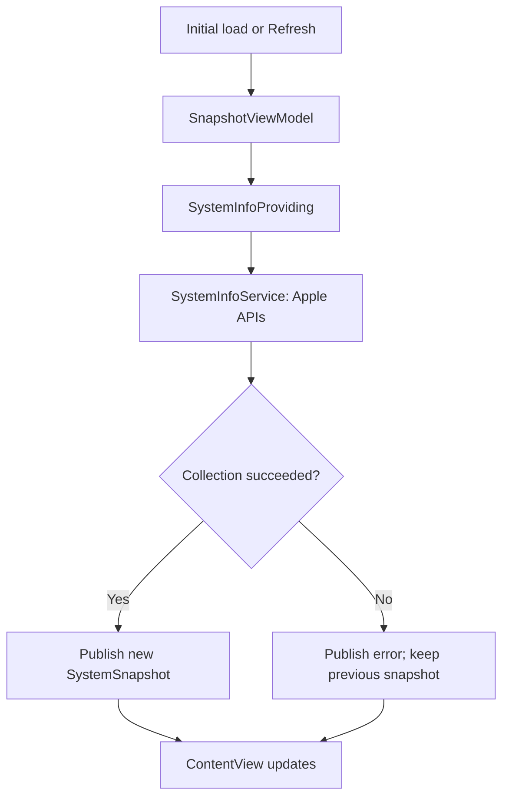
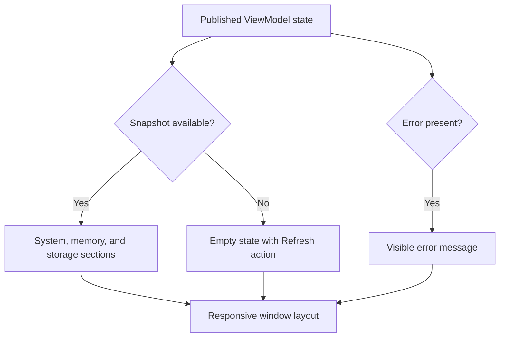
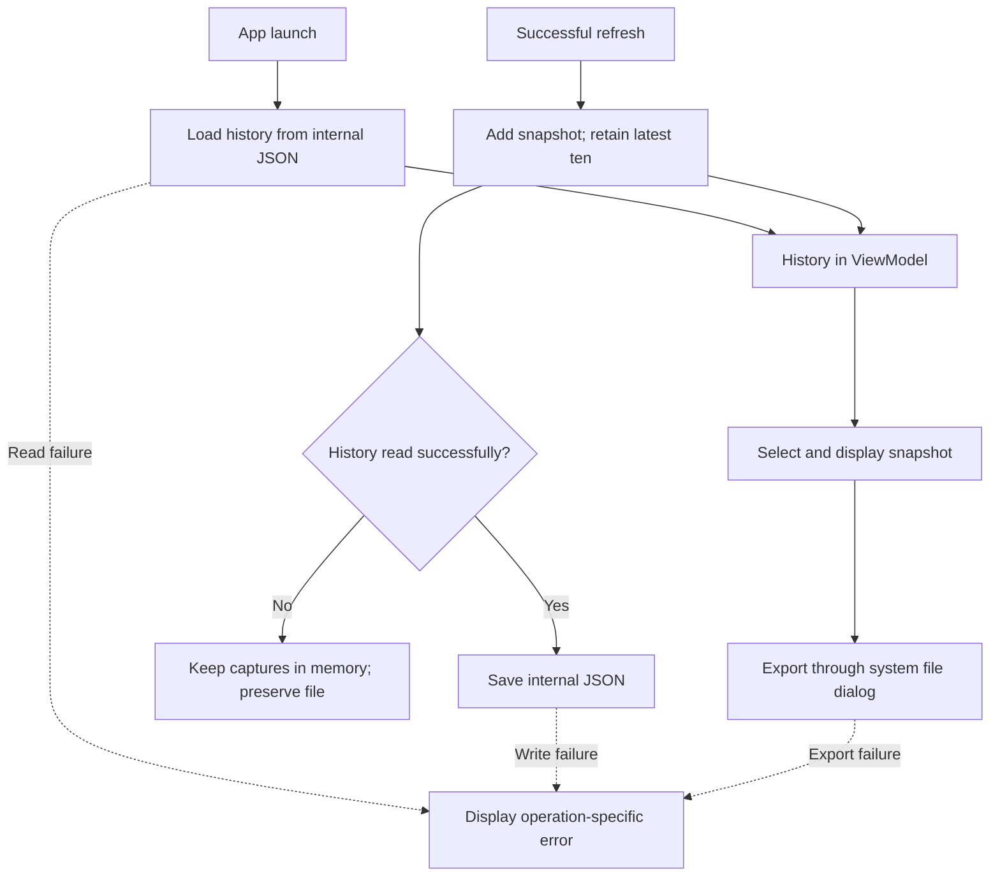

# Mac System Snapshot

A native macOS utility built with Swift and SwiftUI that captures and displays a point-in-time overview of the current Mac. System information is collected through standard Apple APIs with App Sandbox enabled.

Built as a focused Swift and SwiftUI portfolio project, the app combines native system information access, a small MVVM architecture, local JSON history, and sandbox-compatible export. **All four implementation milestones are complete, and all 16 XCTest tests passed locally on a MacBook Air M3.**

## Features

- Device name and macOS version.
- Processor architecture and active logical processor count.
- Installed physical memory.
- Total and available space on the volume containing the app's home directory.
- Capture timestamp for each snapshot.
- Manual refresh using the Refresh button or Command-R while the app is focused.
- Refined SwiftUI interface with System, Memory, and Storage sections.
- Adaptive card layout, selectable values, scrolling, and a minimum window size.
- Available disk percentage and a visual availability indicator.
- Native refresh toolbar, empty state, and an error banner with Retry.
- Local JSON persistence and restoration of history on launch.
- History sidebar with selection of the latest ten captures.
- Export of the selected snapshot as JSON through a native save dialog (Command-E).
- Separate collection, persistence, and export errors with retry actions.
- Failed refreshes preserve existing snapshots; failed saves retain changes in memory.
- Unreadable history is not automatically overwritten.
- 16 XCTest tests covering formatting, calculations, serialization, storage, and ViewModel recovery.

Snapshots are collected on initial display and on demand. The app does not continuously monitor CPU load or memory usage. After successful captures, the app attempts to save history; persistence failures are shown separately. Export creates a separate copy of the selected snapshot.

## Technologies

- Swift and SwiftUI
- Foundation for system information, dates, and formatting
- Darwin for processor architecture detection through `sysctlbyname`
- Combine for `ObservableObject` and `@Published`
- App Sandbox
- AppKit and Uniform Type Identifiers for the native JSON export dialog
- XCTest for automated tests

No third-party packages, shell subprocesses, networking, or database are used.

## Architecture

The application uses a MVVM structure. `SystemSnapshot` is an immutable value model. `SystemInfoService` collects data, `SnapshotViewModel` coordinates captures, history, selection, and errors. `ContentView` renders the sidebar and page state; `SnapshotDetailView` renders the selected capture. The service is injected through `SystemInfoProviding` to test ViewModel behavior with controlled inputs. Storage is also injected through a protocol so tests can simulate read and write failures.

`JSONSnapshotStore` implements `SnapshotStoring` and persists history under Application Support. `SnapshotJSON` centralizes serialization settings, and `SnapshotExporter` handles the native save dialog and export. `SnapshotHistory` limits and deduplicates records.

`@StateObject` preserves the ViewModel at the app level. The view observes it through `@ObservedObject`; changes to its published history and selection trigger UI updates. The ViewModel is isolated to `@MainActor`.

## Development milestones

| Milestone | Scope | Status |
| --- | --- | --- |
| 1 | Model, system service, ViewModel, basic interface, refresh | Implemented; local launch confirmed |
| 2 | Refined interface, logical sections, storage visualization, error presentation | Implemented; local execution confirmed |
| 3 | JSON persistence, last ten snapshots, history selection, JSON export | Implemented; local execution confirmed |
| 4 | XCTest coverage and final project documentation | Implemented; 16 tests passed locally |

### Milestone 1 — System collection and basic UI · Implemented

Implemented flow: an initial load or manual refresh requests a new snapshot. Collection failures are displayed without discarding the previous result.

### Milestone 2 — Interface refinement · Implemented

Implemented: System, Memory, and Storage sections; adaptive cards; consistent spacing and typography; disk availability with a calculated percentage; a native refresh toolbar; and dedicated empty and error states. `SnapshotDetailView` displays a snapshot independently of collection logic. System colors support light and dark appearance. No loading spinner is used for the current synchronous collection operation.

### Milestone 3 — History and JSON export · Implemented

Implemented: history is loaded from and saved to JSON in the sandbox container’s Application Support directory. The sidebar retains the latest ten captures and supports selecting previous records. Export writes the selected snapshot through `NSSavePanel`. Read, write, and export failures have separate messages. If history cannot be read, new captures remain in memory and the existing file is protected from automatic overwrite.

<!-- Add docs/screenshots/image-3.png, then uncomment the image below. -->
<!--  -->

### Milestone 4 — Tests and repository preparation · Implemented

Implemented: 16 XCTest tests cover memory and disk formatting, free-space boundaries, JSON round trips, history limits, storage validation, and ViewModel success and recovery paths. Storage tests use unique temporary directories; ViewModel tests inject a controlled provider and an in-memory store. All 16 tests passed locally. Shared formatting, serialization, and history rules keep these behaviors independently testable.

## Requirements

- macOS 14.0 or later.
- Xcode with the macOS SDK and support for the project's deployment target.
- No external dependencies or paid services.

Development, local application runs, and the XCTest run were performed on a MacBook Air M3. Intel and Rosetta execution have not been verified.

## Running the application

1. Clone or download this repository.
2. Open `MacSystemSnapshot.xcodeproj` in Xcode.
3. Select the `MacSystemSnapshot` scheme and the **My Mac** destination.
4. Keep **App Sandbox** enabled under the app target's **Signing & Capabilities** settings.
5. Under App Sandbox, set **User Selected File** to **Read/Write** for export.
6. If Xcode requests signing configuration, select your development team.
7. Choose **Product > Run** or press **Command-R** in Xcode.

At launch, the app restores history and attempts a new capture. Use **Refresh** to capture and save another snapshot, select a history row to inspect it, and use **Export** to save that selected record separately. The oldest record is removed when the ten-record limit is exceeded. Unsaved changes remain available in memory but may be lost on quit.

## Testing

**Latest local result: 16 tests passed.**

1. Open `MacSystemSnapshot.xcodeproj` in Xcode.
2. Select the `MacSystemSnapshot` scheme and **My Mac**.
3. Choose **Product > Test** or press **Command-U**.
4. View results in the Test Navigator. The scheme's Test action must include `MacSystemSnapshotTests`.

| Test suite | Tests | Coverage |
| --- | ---: | --- |
| `SnapshotLogicTests` | 7 | Binary memory units, decimal disk units and rounding, free-space boundaries, percentage formatting, JSON fields and timestamp encoding, history order and deduplication |
| `SnapshotStoreTests` | 4 | Missing history, saving and reloading ten records, unchanged corrupt files, invalid disk values |
| `SnapshotViewModelTests` | 5 | Initial load and capture, failed refresh, failed save and retry, failed load and recovery, history selection |

`TestSupport.swift` provides fixed sample data, a controllable system-information provider, an in-memory store, and temporary-directory setup and cleanup. Storage tests do not use the app's real history directory. Native save-dialog behavior remains a manual check; the suite does not automate the UI or validate hardware readings on every Mac model.

### Manual verification checklist

- Launch with App Sandbox enabled.
- Compare the device name, macOS version, and installed memory with the Mac's settings.
- Confirm that disk values are nonnegative and available space does not exceed total space.
- Refresh after a few seconds and check that the timestamp changes.
- Resize the window and check that cards switch between one and two columns.
- Check light and dark appearance.
- Compare the available percentage with available bytes divided by total bytes.
- Create more than ten captures and confirm that only ten remain.
- Quit and relaunch; confirm that history is restored and a new capture is added.
- Select an older capture and export it; compare its ID and timestamp with the selected record.
- Cancel export and confirm that no failure or success is reported.

## Project structure

Source paths below are relative to the `MacSystemSnapshot` application directory.

| Path | Responsibility |
| --- | --- |
| `MacSystemSnapshotApp.swift` | App entry point, dependency composition, single main window |
| `Models/SystemSnapshot.swift` | Immutable, Codable snapshot model |
| `Models/SnapshotHistory.swift` | Ordered deduplication and ten-record limit |
| `Persistence/SnapshotJSON.swift` | Shared JSON encoder and decoder settings |
| `Persistence/SnapshotStoring.swift` | History storage contract |
| `Persistence/JSONSnapshotStore.swift` | Validated JSON history and atomic writes |
| `Export/SnapshotExporter.swift` | Native save dialog and selected-snapshot export |
| `Services/SystemInfoProviding.swift` | System-information provider contract |
| `Services/SystemInfoService.swift` | Foundation and Darwin API access; collection errors |
| `ViewModels/SnapshotViewModel.swift` | Observable history, selection, refresh, persistence, and export coordination |
| `Formatting/SnapshotFormatting.swift` | Memory, disk, percentage, and timestamp formatting |
| `Views/ContentView.swift` | Page composition, toolbar, empty and error states |
| `Views/SnapshotDetailView.swift` | Device header, adaptive system and memory cards, storage indicator |
| `PrivacyInfo.xcprivacy` | Declared reason for accessing disk-space APIs |
| `Assets.xcassets` | App visual resources |

The repository root contains `MacSystemSnapshot.xcodeproj`, `.gitignore`, and this README. The separate `MacSystemSnapshotTests` directory contains:

| File | Responsibility |
| --- | --- |
| `TestSupport.swift` | Fixtures, test dependencies, and temporary-directory helper |
| `SnapshotLogicTests.swift` | Formatting, calculations, JSON, and history rules |
| `SnapshotStoreTests.swift` | File-backed storage checks in isolated temporary directories |
| `SnapshotViewModelTests.swift` | State transitions and failure/retry behavior |

Screenshots may be stored under `docs/screenshots/`. Xcode configuration and entitlements belong in version control; build output and personal workspace state are excluded through `.gitignore`.

## Implementation notes

- **Snapshot semantics:** each successful capture creates a new UUID and timestamp. Values are read sequentially, not as an atomic operating-system snapshot.
- **Raw data and presentation:** byte counts remain numeric in the model. Memory is displayed in GiB and disk space in decimal GB; display formatting follows the current locale.
- **Storage scope:** disk values describe the filesystem containing the app's home directory. Available space uses `systemFreeSize` and may differ from Finder's estimate of available space including reclaimable storage.
- **Architecture:** the service queries `hw.optional.arm64` through Darwin rather than relying only on the compiled process architecture.
- **Error handling:** collection errors are propagated to the ViewModel. An unavailable device name uses `Unknown Mac`; unreadable or inconsistent disk information produces an error.
- **Execution:** collection and the small history-file operations run synchronously on the main actor. The export dialog is modal. No directory scanning or background polling is performed; larger datasets would warrant revisiting this choice.
- **Derived values:** `availableDiskFraction` computes a value from 0 to 1, returning `nil` for invalid disk inputs. It is a computed property and is not included in synthesized Codable output.
- **Serialization:** history is a JSON array; export is one JSON object. Dates use milliseconds since the Unix epoch. Both paths share the same codec settings.
- **History ordering:** new captures are prepended. Deduplication preserves the first occurrence of each UUID, then keeps at most ten records; records are not sorted by the wall clock.
- **Persistence:** internal data is stored at `MacSystemSnapshot/snapshots.json` beneath the sandbox’s Application Support directory, resolved through FileManager. Writes use `.atomic`.
- **Recovery:** a missing history file means an empty history. Invalid JSON and other read failures remain visible errors. Retry save first reloads unread history and merges it with in-memory captures before writing. In-memory captures take priority, and the merged history is still limited to ten records.
- **Export:** only the user-selected destination is written. Canceling the save dialog is treated as cancellation, not an error. No persistent access bookmark is needed for a one-time export.
